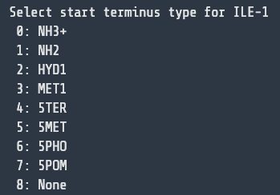
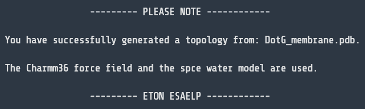

# Protein-Membrane-MD-Tutorial

## Introduction

### The Task

These instructions/tutorial will explain the process for running an atomistic simulation of a protein system embedded in a custom lipid bilayer membrane. The steps will proceed as follows: 
1. Prepare the environment for running the simulation, including installing the required software and creating a Python environment. 👨‍💻
2. Use the `memb_builder.py` python script to insert the protein into the membrane, specifying which lipids will compose the membrane and in what ratios. 🦠
3. Prepare the protein-membrane system for molecular dynamics (MD). Each of the preparation steps and the simulation themselves will be run using the GROMACS simulation software package. 💻
4. Run an energy minimization step so as to ensure that the atoms are in the lowest-possible energy configuration, so that no infinite or unrealistic forces arise from overlapping atoms in the production MD run. ⚡
5. Run an equilibration step that will stabilize the system parameters (temperature, pressure, volume) and ensure that the system is in a physiologically reasonable configuration. 🌡️
6. Run the production MD run. It is from this run that we will get a trajectory file, which we can use to visualize what is happening in our simulation. 📈
7. Visualize our simulation using ChimeraX, the molecular visualization and analysis software. 📺


### Tutorial Purpose

The purpose of this tutorial is to provide an example workflow for running a protein-membrane MD simulation, and not to be comprehensive for everything that can be accomplished using these software. Each specific use-case may require slight adaptations to the general pipeline. Likewise, each use-case may also encourage certain additions to the basic simulation, such as adding external forces or introducing applied constraints. These instructions will seek to explain the most stripped-down base case, though can be used as scaffolding for more complex cases. 

### Prerequisites/Disclaimers

This tutorial assumes you are using a unix-based operating system (Linux or MacOS). The instructions may work on Windows, but have not been tested. The instructions also assume that you are familiar with the command line interface (CLI) and basic bash commands. If you are not familiar with the command line, it is recommended to familiarize yourself with the basics of bash before proceeding.

The tutorial will embed the protein DotG from *Legionella pneumophila*, but the process can be completed with any protein in pdb ([protein databank](https://www.rcsb.org/)) file format. The lipids to be used to generate the membrane are POPC, POPE, and POPG. As with the protein, any combination of lipid files can be used, the lipid pdb files can be obtained from the [Charmm GUI Lipid Library](https://www.charmm-gui.org/?doc=archive&lib=lipid)

##### DotG Images: 


### Software Requirements

Installation of GROMACS and ChimeraX should precede beginning the instructions. Instructions for installation of these software can be found at the following links: [GROMACS Installation](https://manual.gromacs.org/2024.4/install-guide/index.html), [ChimeraX Installation (click "Other releases" for Linux/Windows)](https://www.cgl.ucsf.edu/chimerax/download.html). Another software that will be required is the python package manager anaconda, so [install anaconda](https://docs.anaconda.com/anaconda/install/) for your specific operating system if you don't already have it installed. 

To ensure that GROMACS is installed correctly, run the following command in the terminal:
```
gmx --version
```
If GROMACS is installed correctly, you should see a message that includes the version and specifics of your GROMACS build. 

Similarly, if conda is installed correctly you should be able to run the following: 
```
conda --version
```
If you see a message including your version of anaconda, then it's been installed correctly.

ChimeraX should be installed as an application on your computer, and you should be able to open it from your applications folder.

---

## Instructions

### 1. Prepare the Environment

To begin, clone this repository to your local machine. You can do this by running the following command in your terminal: 
```
git clone https://github.com/caysonjh/Protein-Membrane-MD-Tutorial.git
```
Navigate to the directory where you cloned the repository. The `environment.yml` file is included in the repository, and includes the specs to create the anaconda environment, specifically defining the package [biopython](https://biopython.org/), which includes utility for manipulating pdb files. You can create the environment and activate it using the following set of commands. 
```
conda env create -f environment.yml
conda activate memb_builder
```
---
### 2. Insert the Protein into the Membrane with `memb_builder.py`

The first step will be to insert the protein into the membrane. We will do this using the provided python script `memb_builder.py`. This script is best run through the command line and includes multiple different command line options in order to customize the embedding. When complete, the entire command will look something like the following, and is the command we will use in this tutorial. 
```
python memb_builder.py --protein DotG.pdb --lipids POPC POPE POPG --lipid_ratios 3 5 2 --output DotG_membrane.pdb --box_size 300 --z -90 --buffer 1 --z-buffer 4
```
For specific details on the command line options, see [Command Line Options + Customization](#command-line-options--customization-md_builderpy) in the [Appendix](#appendix) at the bottom of the tutorial.

For the purpose of this tutorial, the parameters are defined as follows: 

- `--protein`: The name of our protein pdb file. In this case, we are using `DotG.pdb`, which is a 18 member polymer that functions as the opening to the Type IV Secretion System (T4SS) in *Legionella pneumophila*. 
- `--lipids`: The names of the lipids we want to use to compose the membrane. In this case, we are using a combination of `POPC`, `POPE`, and `POPG`, which are the lipids that compose the outer membrane of *Legionella pneumophila*.
- `--lipid_ratios`: The ratios of the lipids we want to use to compose the membrane. In this case, we are using a ratio of 3:5:2 for POPC:POPE:POPG.
- `--output`: The name of the output file. In this case, we are using `output.pdb`, but this can be any name you choose.
- `--box_size`: The size of the simulation box to be created. In this case, we are using a box size of 300 &Aring;ngstr&ouml;ms, because this is about twice the width of DotG and gives ample space on either side of the protein.
- `--z`: The z-coordinate where to begin inserting the membrane. In this case, we are using a z-coordinate of -90 &Aring;ngstr&ouml;ms, which aligns the membrane with the polar regions of DotG. This number was obtained through trial and error with various numbers until the membrane was inserted in the right place. 
- `--buffer`: The amount of buffer space to leave between each lipid during insertion. In this case, we are using a buffer of 1 &Aring;ngstr&ouml;ms, which avoids major atom clashes but gives us a realistic lipid density.
- `--z-buffer`: The amount of buffer space to leave between the upper and lower leaflet in the membrane. In this case, we are using a z-buffer of 4 &Aring;ngstr&ouml;ms, which is a good starting point for separating the two leaflets. This number was also obtained through trial and error with various numbers until the two leaflets were separated enough to avoid clashes but close enough so the two leaflets don't separate during simulation.

Once you've run the command and generated the output file, you should be able to view it in ChimeraX. You can either open ChimeraX and use the built in GUI to select the file, or just run `open output.pdb` in the terminal. Ensure that the system looks as desired before proceeding to the next step. It should look something like the following: 


### 3. Prepare the System for MD

#### 3.1 Create the Topology File
The first thing needed to prepare the system for MD is to create a topology file. This file will contain all the information about the protein system as defined by the parameters in the forcefield. A forcefield contains all the information describing the interactions between atoms both within and between molecules. It allows the bonds to be represented in a mathematical way so that the motion of the atoms can be tracked and updated throughout the simulations. The forcefield that we will be using is [Charmm36](https://gromacs.bioexcel.eu/t/newest-charmm36-port-for-gromacs/868), as it is the only forcefield that has thus far incorporated support for lipid systems. This forcefield is not included automatically with the GROMACS download as many other forcefields are, so we need to include the force field files in the working directory. The files are located in the `charmm36.ff` directory, and have been specifically modified to include the definitions for the lipids we are working with.
> **Note:** If you are working with custom lipids that are not already included in the `charmm36.ff/lipids.rtp` file, you will need to add the atom, bond, and improper information as exemplified by the other entries in `charmm36.ff/lipids.rtp`, and the information can be obtained from the [Charmm topology files for lipids](https://www.charmm-gui.org/?doc=toppar)

To create the topology file, we will use the [`gmx pdb2gmx`](https://manual.gromacs.org/documentation/current/onlinehelp/gmx-pdb2gmx.html) command. The command will look something like the following. 
```
gmx pdb2gmx -f DotG_membrane.pdb -o system.pdb -water spce -p system.top -ff charmm36 -ignh -ter
```
The parameters are defined as follows:
- `-f`: The input structure file. In this case, we are using `DotG_membrane.pdb`, which is the output file from the previous step
- `-o`: The output structure file. `pdb2gmx` will automatically add any missing hydrogen molecules, so we need a new structure file to be used moving forward. In this case, we are using `system.pdb`, this can be any name you choose
- `-water`: The water model to use, in this case we are using `spce`, which is a common water model used in MD simulations. 
- `-p`: The name of the topology file to be created. This will define how many of each atom type are present in the system, and include the relevant files that define their interaction. In this case, we are calling it `system.top`, but this can be any name you choose. 
- `-ff`: The forcefield to use. In this case, we are referencing the `charmm36` forcefield in our current directory. If you don't specify this option, then an interactive prompt will ask you to select one of the built-in forcefields
- `-ignh`: This option ignores any hydrogen atoms in the input structure. This is important because the `pdb2gmx` command will automatically add missing hydrogen molecules, and trying to account for the hydrogen molecules that are present often causes errors. 
- `-ter`: This option specifies that we want to specify the terminal groups manually, instead of pdb2gmx trying to guess what they are. There is a known [bug with GROMACS and Charmm36](https://gromacs.bioexcel.eu/t/newest-charmm36-port-for-gromacs/868/10) where the guessed termini will be incorrect

As you run the command, you will see interactive prompts such as the following:



In response to these prompts, you should always select the default option by entering `0` and pressing enter. However, if the `0` option is `MET1`, then you **MUST** select the second option, or input `1`. Otherwise errors will be thrown about unrecognized molecules. 

If you see the following prompt, then you have successfully created the topology file: 



You will also see numerous `.itp` files created in the directory. These files contain information about the interactions between the atoms as parsed by `pdb2gmx`.

#### 3.2 Create the Simulation Box

The next step is to create the simulation box. We will define the size of the box we are using, which will determine how many solvent molecules are added later to fill the space. We will use the [`gmx editconf`](https://manual.gromacs.org/current/onlinehelp/gmx-editconf.html) command for this: 
```
gmx editconf -f system.pdb -o system_box.pdb -bt cubic -box 32
```
Here we define the parameters: 
- `-f`: The input structure file. In this case, we are using `system.pdb`, the output file from the previous step
- `-o`: The output structure file. In this case, we are using `system_box.pdb`
- `-bt`: The type of box to create. In this case, we are using a cubic box, but other options are available
- `-box`: The size of the box to create. In this case, we are using a box size of 30 nm, which is the same width as the membrane we created, plus a small buffer to avoid overlapping atoms. 

The box will have periodic boundary conditions, so we want the box the exact width of the membrane so that the lipids interact across the barrier of the box and we get an accurate representation of what would be a much wider membrane. 

#### 3.3 Add Solvent

The next step is to add solvent to the system. We will use the [`gmx solvate`](https://manual.gromacs.org/current/onlinehelp/gmx-solvate.html) command for this: 
```
gmx solvate -cp system_box.pdb -p system.top -o system_solv.pdb
```
We define the parameters as: 
- `-cp`: The input structure file. In this case, we are using `system_box.pdb`, the output file from the previous step
- `-p`: The topology file to use. This will be updated to include the solvent molecules that are added
- `-o`: The output structure file including the newly added solvent molecules


#### 3.4 Add Ions

Before we proceed to simulation, we need to add ions to neutralize the charge of the system. Running a simulation with a charged system can cause unwanted artifacts and lead to inaccurate results, and thus should be avoided except in special cases. We will use a combination of the [`gmx grompp`](https://manual.gromacs.org/current/onlinehelp/gmx-grompp.html) and [`gmx genion`](https://manual.gromacs.org/current/onlinehelp/gmx-genion.html) command. `grompp` will create a `.tpr` file that is effectively a run file that `genion` uses to know how many ions should be included. 
```
gmx grompp -f mdp_files/ions.mdp -c system_solv.pdb -p system.top -o ions.tpr
echo SOL | gmx genion -s ions.tpr -o system_ions.pdb -p system.top -pname NA -nname CL -neutral
```

The parameters for `grompp` are:
- `-f`: The input mdp (molecular dynamics parameters) file. In this case, we are using `ions.mdp`, which contains the parameters for the ion addition.  
- `-c`: The input structure file. In this case, we are using `system_solv.pdb`, the output file from the previous step
- `-p`: The topology file to use. This will be updated to include the ions that are added
- `-o`: The run file to be created that `genion` will use.

The parameters for `genion` are:
- `-s`: The input run file. We are using `ions.tpr`, the output from `grompp`
- `-o`: The output structure file. In this case, we are using `system_ions.pdb`, which will contain the final structure after the ions are added
- `-p`: The topology file to use.
- `-pname`: The name of the positive ion to add. In this case, we are using `NA`, which is sodium
- `-nname`: The name of the negative ion to add. In this case, we are using `CL`, which is chloride
- `-neutral`: This option tells `genion` to neutralize the system. This means that it will add enough ions to ensure that the total charge of the system is zero.

The `echo SOL` section of the command tells `genion` that, in order to insert the ions into the system, we should replace the solvent molecules. 

### 4. Energy Minimization

The next step is to run an energy minimization. This will ensure that the system is at the lowest possible energy configuration, which is important for ensuring that the production run will be accurate. We will again use [`gmx grompp`](https://manual.gromacs.org/current/onlinehelp/gmx-grompp.html) to create a `.tpr` run file and then we will use ['gmx mdrun'](https://manual.gromacs.org/current/onlinehelp/gmx-mdrun.html) to run the minimization. 
```
gmx grompp -f mdp_files/em.mdp -c system_ions.pdb -p system.top -o em.tpr 
gmx mdrun -s em.tpr -v -c em.pdb -o em.trr
```
The parameters for `grompp` are: 
- `-f`: The input mdp file. In this case, we are using `em.mdp`, which contains the parameters for the energy minimization. This file is included in the repository and can be modified according to the [MDP Options](https://manual.gromacs.org/current/user-guide/mdp-options.html) to customize your runs
- `-c`: The input structure file. In this case, we are using `system_ions.pdb`, the output file from the previous step
- `-p`: The topology file to use. 
- `-o`: The run file to be created that `mdrun` will use. 

The parameters for `mdrun` are: 
- `-s`: The input run file. In this case, we are using `em.tpr`, the output from `grompp`
- `-v`: This option tells `mdrun` to be verbose and print out the progress of the run
- `-c`: The output structure file. In this case, we are using `em.pdb`, which will contain the final structure after the energy minimization
- `-o`: The output trajectory file. In this case, we are using `em.trr`, which will contain the trajectory of the energy minimization run

The system will look something like this following the minimization: 


Notice that the lipids contracted slightly, which is the lowest energy configuration.

### 5. Equilibration

Following the energy minimization, we need to run an equilibration step to bring the system to a stable state, ensuring thermal equilibrium and a relaxed structure. We will again use [`gmx grompp`](https://manual.gromacs.org/current/onlinehelp/gmx-grompp.html) to create a `.tpr` run file and then we will use [`gmx mdrun`](https://manual.gromacs.org/current/onlinehelp/gmx-mdrun.html) to run the equilibration.
```
gmx grompp -f mdp_files/eq.mdp -c em.pdb -p system.top -o eq.tpr
gmx mdrun -s eq.tpr -v -c eq.pdb -o eq.trr
```

The parameters for equilibration largely mirror those of energy minimization, so specific details will be omitted. The only difference lies in the different parameter specifications in `eq.mdp`

The system will look something like this following the equilibration: 


Notice that the lipids are no longer ordered in a perfect grid pattern, and have taken on a more natural configuration.

### 6. Production MD Run 

Once the system is minimized and equilibrated, we are ready to run the production MD run, which is the actual simulation we will be analyzing the trajectory of. Once again we will use [`gmx grompp`](https://manual.gromacs.org/current/onlinehelp/gmx-grompp.html) and [`gmx mdrun`](https://manual.gromacs.org/current/onlinehelp/gmx-mdrun.html).
```
gmx grompp -f mdp_files/md.mdp -c eq.pdb -p system.top -o md.tpr
gmx mdrun -deffnm md -v 
```
The only difference we see in these parameters is the use of `-deffnm`, which specifies the default name we are using for each of the files in the simulation. It tells to `mdrun` to look for `md.tpr` as the input run file, and also to use `md` as the filename for each of the output files. Once this has run successfully, you should find a `md.xtc` file which contains the simulation trajectory.

### 7. Prepare for Visualization

These files generated by the production run are very large because the addition of solvent greatly increases the total number of atoms. Before we visualize the trajectory in ChimeraX we need to separate the proteins and ligands from the solvent in the structure and trajectory files. This can be done using [`gmx trjconv`](https://manual.gromacs.org/current/onlinehelp/gmx-trjconv.html).
```
gmx trjconv -f md.xtc -o out.xtc -pbc nojump -s eq.pdb
gmx trjconv -f eq.pdb -s eq.pdb -o out.pdb
```
The `-pdb nojump` option specifies that if, at any point in the simulation, the protein has moved across the periodic boundary condition, then the protein should remain intact in the visualization and not jump to the other side of the box. 

Each of these commands will open a interactive prompt asking which section of the system you want to include in the output file. Select the option for `non-Water`.

### 8. Visualize the Trajectory in ChimeraX

Now that we have the prepared output files, you can open the `out.pdb` and `out.xtc` files in ChimeraX. 

Congrats, you have successfully run a protein-membrane MD simulation! If you were successful, you should see a simulation that looks something like the following: 


You can update the `md.mdp` file to run the simulation for longer.

## Appendix

#### Command Line Options + Customization (md_builder.py)

 `--protein`: The name of the protein pdb file. 
  - This file should be in the same directory as the script. 
  - To use a different protein, simply specify the name of a valid pdb file in the same directory as the script. 
  - This option is also configured to accept multiple proteins, and can thus embed multiple proteins into a membrane together. 
  - The protein pdb files *must* be in your desired location (i.e. centered vs located at other coordinates) prior to running the script. If you are unsure of the configuration, run `gmx editconf -f your_protein.pdb -center 0`. The output will include a line that indicates the center of your protein. It will automatically center the protein and output a file called `out.pdb`, which you can delete if centering the protein is not needed for what you are doing. 
  - If you are including multiple proteins, or a single protein with a large hollow space, you will need to split the proteins into multiple files and provide them separately to the `--protein` option. The script is not sophisticated enough to recognize empty space within a protein's area and will not place lipids there. 

`--lipids`: The names of the lipids the membrane will be composed of.
  - The lipid files corresponding to the names of provided here should be in the same directory as the script (i.e. if `--lipid POPC` is specified then `POPC.pdb` should be in the directory)
  - Any number of lipids can be specified, and can be inserted in any ratio, specified by `--lipid_ratios`.
  - The script will automatically center and prepare the lipid file, so no additional preparation is needed here.

`--lipid_ratios`: The ratios of the lipids specified in `--lipids`.
  - The ratios should be specified in the same order as the lipids in `--lipids`.
  - The ratios should be integers, and there should be the same number specified as there are lipids in `--lipids`.
  - This will not affect the total number of lipids inserted into the membrane, but rather allows for membranes composed of multiple lipids.

`--output`: The name of the output file.

`--box_size`: The size of the simulation box to be created (in &Aring;ngstr&ouml;ms).
  - This primarily determines the size of the membrane, and should be large enough to encompass the entirety of the protein. It will also directly determine how many lipids are inserted.

`--z`: The z-coordinate where to begin inserting the membrane. 
  - This is the z-coordinate where lipid insertion will begin, specifically the lower leaflet.
  - This option can be adjusted to change where in relation to your protein the membrane is placed. The default will insert the membrane at the center, but often membranes should be inserted at the polar region of the protein. 
  - This is often best figured out by trial and error, as the script will not automatically determine the best z-coordinate for the membrane.

`--buffer`: The amount of buffer space to leave between each lipid during insertion (in &Aring;ngstr&ouml;ms). 
  - This will directly affect the density of the membrane. 
  - Adding a smaller buffer will increase membrane density, but will also increase the risk of atoms overlapping and causing infinite forces and other issues during simulation. 

`--z-buffer`: The amount of buffer space to leave between the upper and lower leaflet in the membrane (in &Aring;ngstr&ouml;ms). 
  - This will directly impact how close the two membrane leaflets are to each other.
  - The script will automatically separate the two leaflets by the average height of each of the lipids included, but this is often not enough to separate the two leaflets. 
  - Because we want there to be as little gap between the leaflets as possible, this is often best figured out by trial and error. 


